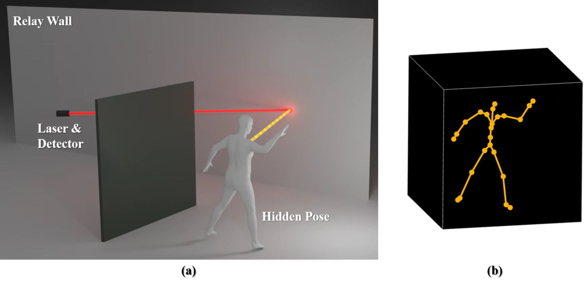

# HiddenPose

This code repository is for paper
*HiddenPose: Non-Line-of-Sight 3D Human Pose Estimation*
（[paper pdf](todo.com)）


### Prerequisites

We run our code in  Ubuntu 18.04.6 LTS with **Pytorch 1.7.1**

Here is one example of building development environment with conda:

```
conda create -n hidden_pose python=3.8
conda activate hidden_pose
conda install pytorch==1.7.1 torchvision==0.8.2 torchaudio==0.7.2 cudatoolkit=11.0 -c pytorch
python -m pip install tensorboard
python -m pip install yacs
python -m pip install scipy
python -m pip install einops
python -m pip install opencv-python
python -m pip install matplotlib
python -m pip install timm
python -m pip install torchsummary
python -m pip install wandb
```

### Data

Download link is [HiddenPose - Google drive](https://drive.google.com/drive/folders/1GHYR1E10InarsEMdyj811s_36pod-57k?usp=sharing)

HiddenPose dataset including two parts.

1. simulation data

```
Google drive: HiddenPose/pose_v2_noise
```

The data should be origanalzed as :

```
pose_v2_noise
├── pose_00
│   ├── test
│   │   ├── joints
│   │   ├── meas
│   │   └── vol
│   ├── train
│   │   ├── joints
│   │   ├── meas
│   │   └── vol
│   └── val
│       ├── joints
│       ├── meas
│       └── vol
├── pose_01
│   ├── test
│   │   ├── joints
│   │   ├── meas
│   │   └── vol
│   ├── train
│   │   ├── joints
│   │   ├── meas
│   │   └── vol
│   └── val
│       ├── joints
│       ├── meas
│       └── vol
├──......
└── pose_08
    ├── test
    │   ├── joints
    │   ├── meas
    │   └── vol
    ├── train
    │   ├── joints
    │   ├── meas
    │   └── vol
    └── val
    │    ├── joints
    │    ├── meas
    │   └── vol  
    └── val
        ├── joints
        ├── meas
        └── vol
```

2. measured data

```
Google drive: HiddenPose/measured_data
```

## Running the codes

### Train

```
python ./train.py
```
### Model Weights

Download link is [HiddenPose - Google drive](https://drive.google.com/drive/folders/1-YnOafBX0osfid3_RKIXWRGxS7RoSI97?usp=sharing)

### Test

* Real data from HiddenPose

```
python test.py --test test_realdata --model ./trained_weights/NlosPose_final_dict_14.pth --device 0
```

* Test data from HiddenPose

```
python test.py --test test_pose_v2 --model ./trained_weights/NlosPose_final_dict_14.pth --device 0
```